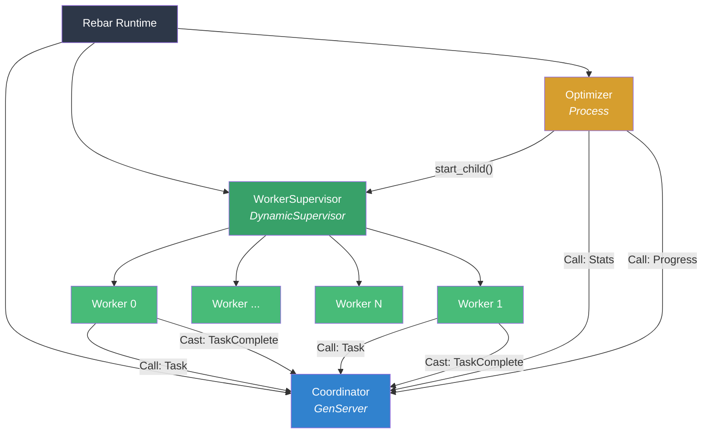

# Mega Obj Soaker

**Self-optimising actor-based S3-compatible object storage downloader**

A high-performance Rust rewrite of [super-obj-soaker](https://github.com/alexandernicholson/super-obj-soaker), built on the [rebar](https://github.com/alexandernicholson/rebar) actor runtime. Drop-in replacement with identical CLI and environment variable contracts.

## Features

- **Actor-based concurrency** — Uses rebar's GenServer and DynamicSupervisor (BEAM-inspired actor model) for lock-free coordination
- **Self-optimising** — Dynamically scales worker count based on measured throughput, stopping when gains plateau
- **Resumable downloads** — Skips files that match on size and modification time, re-downloads partial files
- **S3-compatible** — Works with any S3-compatible service via `--endpoint-url` (AWS S3, MinIO, SeaweedFS, etc.)
- **Include/exclude patterns** — Shell glob filtering matching AWS CLI behaviour
- **Fault tolerant** — DynamicSupervisor provides crash recovery for worker processes
- **Configurable** — All tuning parameters exposed via environment variables

## Architecture



### Actor Roles

| Actor | Type | Responsibility |
|-------|------|----------------|
| **Coordinator** | GenServer | Owns the task queue, tracks progress and byte counters, responds to Call/Cast messages |
| **WorkerSupervisor** | DynamicSupervisor | Manages worker lifecycle with crash recovery (`max_restarts=100` per 60s) |
| **Worker** | Process (temporary) | Requests tasks from Coordinator, downloads objects, reports completion |
| **Optimizer** | Process | Samples throughput every `OPTIMIZATION_INTERVAL` seconds, scales workers when >5% improvement detected |

### Optimisation Algorithm

1. Every interval, the Optimizer queries the Coordinator for bytes downloaded since the last check
2. Calculates current speed in MB/s and appends to a 60-sample rolling history
3. If speed increased >5% from the previous sample and is below `MAX_SPEED`, spawns 5 additional workers (capped at `MAX_PROCESSES`)
4. If speed plateaued or decreased, holds steady — workers are never scaled down
5. Exits when all tasks are complete

## Installation

### From Release

Download the latest binary from [Releases](https://github.com/alexandernicholson/mega-obj-soaker/releases):

```bash
# Linux x86_64
curl -LO https://github.com/alexandernicholson/mega-obj-soaker/releases/latest/download/mega-obj-soaker-x86_64-unknown-linux-gnu.tar.gz
tar xzf mega-obj-soaker-x86_64-unknown-linux-gnu.tar.gz
sudo mv mega-obj-soaker /usr/local/bin/
```

### From Source

Requires Rust 1.85+ (edition 2024) and a local clone of [rebar](https://github.com/alexandernicholson/rebar) as a sibling directory.

```bash
git clone https://github.com/alexandernicholson/rebar.git
git clone https://github.com/alexandernicholson/mega-obj-soaker.git
cd mega-obj-soaker
cargo build --release
cp target/release/mega-obj-soaker /usr/local/bin/
```

### Docker

```bash
docker-compose up --build
```

## Usage

```
mega-obj-soaker <SOURCE> <DESTINATION> [OPTIONS]
```

### Arguments

| Argument | Description |
|----------|-------------|
| `SOURCE` | S3 URI (e.g. `s3://bucket/prefix`) |
| `DESTINATION` | Local filesystem path |

### Options

| Flag | Default | Description |
|------|---------|-------------|
| `--region <REGION>` | `us-east-1` | AWS region |
| `--log-level <LEVEL>` | `INFO` | Logging level: `DEBUG`, `INFO`, `WARNING`, `ERROR` |
| `--endpoint-url <URL>` | — | Custom S3 endpoint for S3-compatible services |
| `--include <PATTERN>` | — | Glob pattern to include (repeatable) |
| `--exclude <PATTERN>` | — | Glob pattern to exclude (repeatable) |

### Examples

**Basic download:**

```bash
mega-obj-soaker s3://mybucket/data /local/path
```

**Custom region and endpoint (MinIO, SeaweedFS, etc.):**

```bash
mega-obj-soaker s3://mybucket/data /local/path \
  --region us-west-2 \
  --endpoint-url http://localhost:8333
```

**Selective download with patterns:**

```bash
mega-obj-soaker s3://mybucket/data /local/path \
  --exclude "*" --include "*.parquet"
```

**Tuned for maximum throughput:**

```bash
MAX_PROCESSES=64 OPTIMIZATION_INTERVAL=5 \
  mega-obj-soaker s3://mybucket/data /local/path
```

## Configuration

All tuning is done via environment variables:

| Variable | Type | Default | Description |
|----------|------|---------|-------------|
| `MIN_PROCESSES` | int | `1` | Minimum concurrent download workers |
| `MAX_PROCESSES` | int | `16` | Maximum concurrent download workers |
| `MAX_SPEED` | float | ~unlimited | Speed ceiling in MB/s — stops scaling when reached |
| `OPTIMIZATION_INTERVAL` | float | `10.0` | Seconds between throughput sampling |
| `MAX_RETRIES` | int | `3` | Retry attempts per failed download |
| `RETRY_DELAY` | float | `5.0` | Seconds between retries |
| `S3_VERIFY_SSL` | bool | `true` | Verify SSL certificates |

## Project Structure

```
mega-obj-soaker/
├── Cargo.toml
├── Dockerfile
├── docker-compose.yaml
├── run_tests.sh
└── src/
    ├── main.rs          # CLI entry point, rebar runtime bootstrap
    ├── config.rs         # Environment variable parsing
    ├── s3.rs             # S3 client, listing, download with resume/retry
    ├── pattern.rs        # Glob include/exclude filtering
    ├── coordinator.rs    # GenServer: task queue + stats + progress
    ├── worker.rs         # Worker download loop
    ├── optimizer.rs      # Throughput monitoring and worker scaling
    └── supervisor.rs     # Supervision tree wiring
```

## Testing

```bash
# Unit tests
cargo test

# Integration tests with SeaweedFS
./run_tests.sh
```

## License

[MIT](LICENSE)
